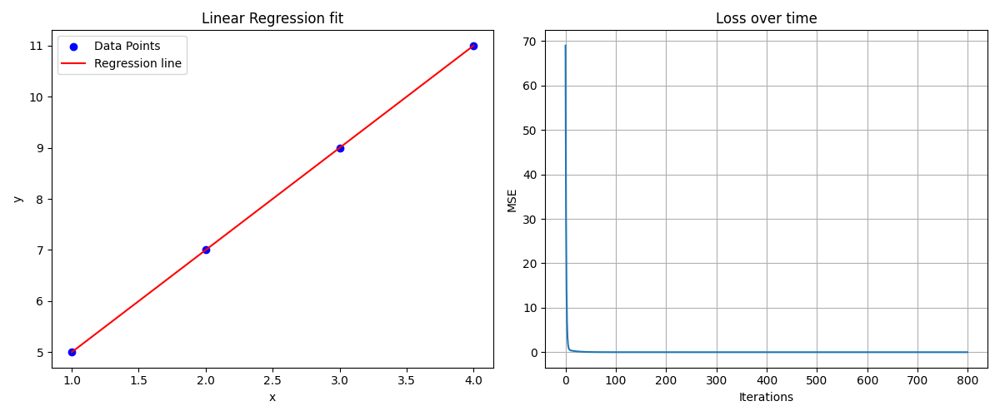

# Week 1: Linear Regression from Scratch

## What I built

I implemented the linear regression using gradient descent. The model learns to fit a line on some data points by adjusting the weights and noise based on the mean squared error (loss function). It uses gradients multiplied with a learning rate to change.

## My Learning Process

### Reality: Took way longer than expected

**Original Plan** 4 hours on Jan 16 2026

**What actually happened:** Spread work + learning across Jan 17, 19, 20, 21

**Saturday (3 hours):** I got the basic structure of the class down. I also got the predict() function working with testing. I started on the fit() function but could not derive the gradient for the weights.

**Monday (1 hour):** I derived the weight gradient and understood the steps. The mistake I made was that I did not know the matrix notation for sums but I have figure it out. The bias was much easier to derive as it did not use the transpose of X. 

**Tuesday (1 hour):** I tested and coded the fit() function and it works! I then created an R^2 function to see how accurate my predictions are. I want to see if the dependent variable statistically significant or random by later implementing the p value on real datasets.

**Total Time:** around 5 hours (an hour more than I expected but I understood it all)

## Why it took longer

### Struggles

**Deriving the gradients** were hard to do because I had to learn the matrix functions and notation plus the calculus that goes along with it. I figured out the weight gradient 'dw = 2/n * X.T @ (y_pred - y)' but i did not understand some stuff about it including:

1. ***Why X.T*** I used X for the first 30 mins of deriving the equation and I got a bunch of shape errors.

**Matrix dimensions** were confusing at first:
- I got many errores about how shapes were not aligned
- I drew matrix on paper and that help a lot

**What helped:**
- The break I took allowed me to think on my own time in the right environment
- Drawing matrices down

## Bug: Shapes Misaligned

I got this error
```
ValueError: shapes (100, 1) and (100,) not aligned
```
**What I tried to do**
- Google the error and use AI to explain this error
- Did not understand at first so I debugged by printing shapes and added `.reshape()` in a lot of places but that did not work

**What finally worked:**
- Printed all the shapes  
```python
print(f"X: {X.shape}")  # (100,1)
print(f"X.T: {X.T.shape}")  # (1, 100)
print(f"errors: {(y_pred - y).shape}")  # (100,)
print(f"result: {np.dot(X.T, (y_pred - y)).shape}")  # (1,)
```

- Drew the shapes on paper and searched up why X.T @ (y_pred-y) = (1,)
- Figured out that only this case is problematic because this means that there are 100 data samples with 1 feature. This means that there are an infinite solutions for one point and 100 weights.
- my code was fine but my data was not good for a regression
**Time spent:** 45 minutes

**What I learned**
- Visualizing is way more efficient than searching up answers and pretend you understand
- Simple cases can hide bugs as I saw in 1 feature compared to multiple

## Experiments I tried

### Learning rate sensitivity

I tested learning rates  from 0.001 to 1.0

| Learning Rate | Final Loss | Behavior | Learned weights and bias (real w = 2, real b = 3) |
|---|---|---|---|
|0.001|0.397|too slow and doesn't converge| w = 2.52, b = 1.46 (way off)|
|0.01|0.001|pretty close with smooth converge| w = 2.03, b = 2.89|
|0.1| 3*10^-27|perfect with really smooth convergence| w = 2, b = 2.99999999994|
|0.5|NaN|the gradient diverges| - |

**Insight:**
One order of magnitude (0.001 vs 0.1) = totally different behavior
Learning rate is very senstive and there is a "Goldilocks" zone on how to make it work perfectly.

### Breaking Things on purpose

To understand why this works, I wanted to see what will happen if some parameters were tweaked

**Test 1:** Changed `weights -= dw*lr` to `weights += dw*lr`
- **Result:** Loss shot up to infinity
- **Why:** Iterating positive increases the loss rather than decreasing

**Test 2:** Removed learning rate: `weights -= dw` instead of `weights -= lr * dw`
- **What I think will happen:** Since we don't have a learning rate, it is basically the same thing as having a learning rate of 1.0. We already know that 0.5 diverges so 1.0 would also diverge.
- **Result:** The loss function diverged immmediately as their is no dampening.

**Test 3:** Initialize weights as a different number such as 10
- **What I think would happen:** I think that it would be less accurate since the number is far from the actual weight
- **Result:** Nothing happened. I got the same values
- **Why:** Gradient descent finds the minimum from any point (convex functions only)
- **This shows:** The initial point does not matter for linear regression

## Results

**Final model performance:**
- Learned: w = 2, b = 2.99999999994
- True values: w = 2, b = 3
- R^2 = 100%
- Final loss: 3* 10^-27
- Used 800 iterations



**Left Plot:** The red line fits right through the blue points. It confirms that the model learned the pattern and didn't just memorize noisy points.

**Right Plot:** Loss starts at around 69 and drops steeply in ~60 iterations. Then it plateaus at loss = 0. I most likely could use 100 iterations to save computing time.

## What I Actually Learned

### 1. Learning rate is extremely sensitive

I was confused and shocked that 0.1 was perfect but 0.12 diverges. 

This really made me realize that these parameters are really important to finely tune and not just guess or else divergence can happen.

### 2. I learned more from breaking the code than making

When I intentionally change the `-=` to a  `+=` and saw the loss function diverge and explode to infinity, I actually understood why it has to be negative.

## Connections to What I Already Know

### Really similar to Physics Simulations (Euler's Method)

This really felt like Euler's method which I used for simulation time stepping:

**Euler's Method:** x(new_t) = x(t) + dt*dx/dt
**Gradient Descent:** w(next_iter) = w(current) - lr * gradient

THey have the same pattern as they iterate starting from some current state. 

The learning rate resembles dt in the physics one:
- Too big means inaccurate results -> simulation explodes
- Too small means it will take forever

## What I dont understand

**1. How do I choose the right learning rate systematically?**

1. I tried 7 different learning rates and saw the loss function in each test. There is no way that this is the fastest way to do this?

My plan would be to search up "dynamic learning rate for linear regression"

## What I would try next

**If I had even more time:**
- I would make the program stop when it converges so the model doesn't train unnecessarily
- I would try to test on online real datasets and then implement the p-value to see statistical significance.


**Preparing for Week 2**
- Apply what I learned from mistakes
- Try seeing what would happen if things were broken intentionally
- Take breaks if needed
- Visualize on paper and then code.


## Time Breakdown
**Total: ~5 hours**

**Saturday (3 hours)**
- Setup & Structure : 30 mins
- Predict method: 25 m
- Fit method attempt: ~2 hrs

**Monday(1 hour)**
- Drew and figured out the gradients: 45 mins
- Got training to work (15 mins)

**Tuesday (1 hour)**
- Experimented with learnign rates (30 mins)
- Started documentation (30mins) 

**Wednesday - Sunday (1 hr total)**
- Worked on and finished documentation

**What took longer than expected**
Gradient calculation/derivation to long for me to comprehend. I thought I would get it but it took me 2+ hours.

**What was easier**
After figuring out the gradients, everything became easy.

**What I learned:**
Coding is easy once you fully understand the procedures behind the purpose of the program. I need to spend more time in understanding the math and whatnot instead of staring at empty code waiting for a click to happen.
## Code Structure 
```
week1-linear-regression/
├──linear-regression.py
├──experiments/
|  ├──learning_rate_test.py
|   ├──0.1.png
|   ├──0.01.png
|   ├──0.001.png
|   ├──0.5.png
|   ├──0.125.png
|   ├──0.175.png
|   ├──0.1125.png
├──results.png
└──week1-README.md
```

## How To Run

```bash
python linear_regression.py

#Learning rate experiments
cd experiments
python learning_rate_test.py
```


