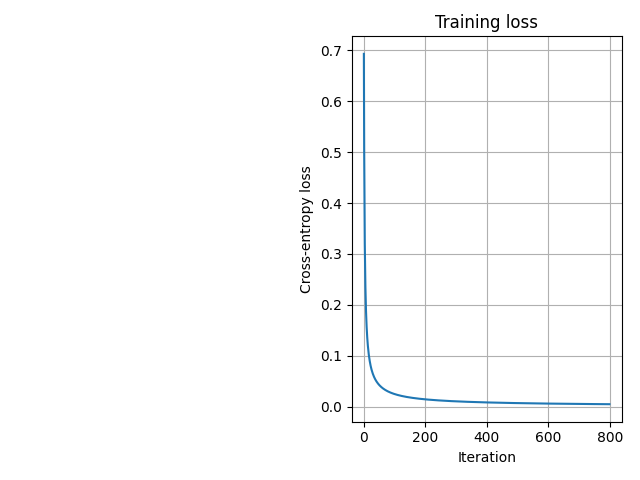
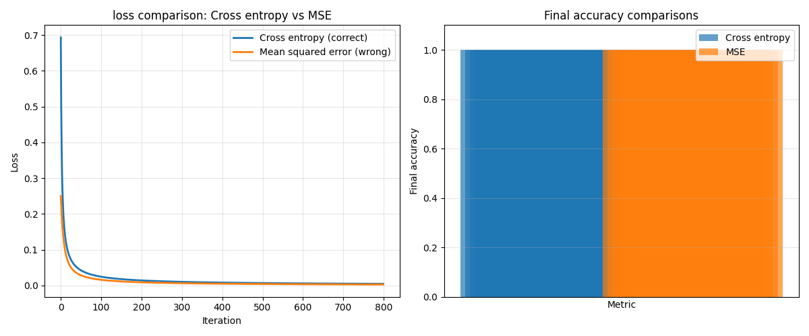
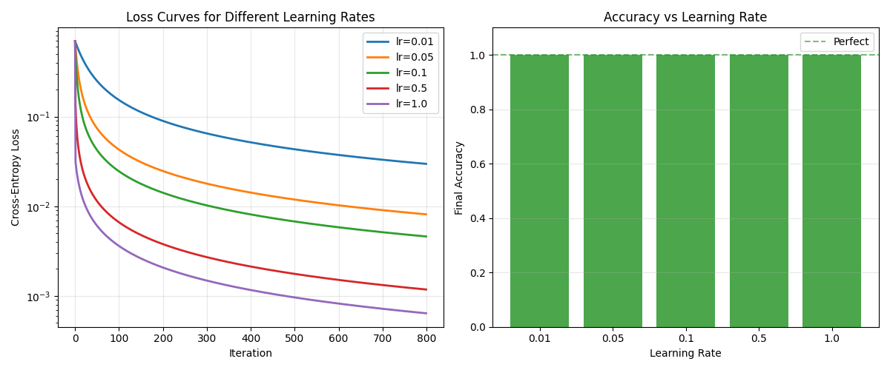
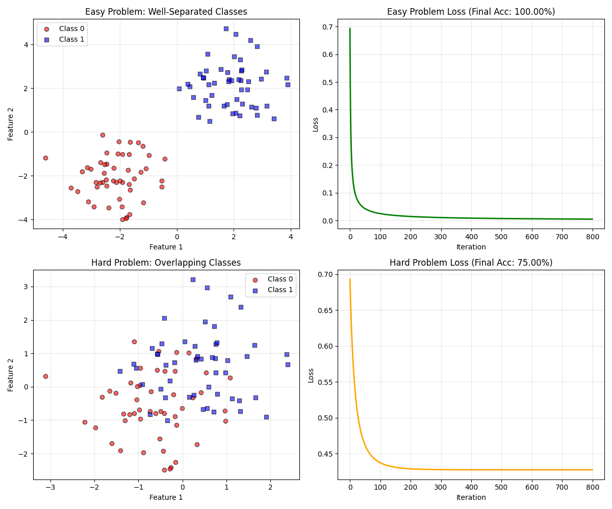

# Week 2: Logistic Regression

**Status:** Scheduled for Jan 31 - Feb 6, 2026

Postponed one week from original schedule (Jan 24 - 30) due to Science Olympiad invitational preparation.

Will implement logistic regression with sigmoid activation and binary cross entropy loss


## What I built

I extended Week 1's linear regression to binary classification by adding:
1. **Sigmoid** - squashes linear output to (0, 1) for probabilities
2. **Cross Entropy** - better for logistic regressions compared to MSE

The model learns to seperate two classes by find a linear decision bound.

## My Learning Process

### Preparation

**Before coding, I:**
- Watched StatQuest Logistic Regression and a video about derivation of the gradient descent for cross entropy
- Plotted sigmoid function myself to see the S shaped curve
- Reviewed the cross entropy formula and derived the gradients.

**Key Realization:** Logistic regression is just a linear regression with 2 different changes (sigmoid + cross entropy loss). 90% of my linear regression code looks like my logistic regression code.

### During Implementation

**What when smoothly:**
- Sigmoid was pretty straight forward
- predict_probability and predict methods were easy to implement
- overall structure was very similar to week 1

**What I struggled with:**
- I first did not clip my y_prediction variable before the log. This caused my code to get divide by zero errors as log(0) is undefined

## Bugs I hit (and Fixed)

### Bug 1: 

**Problem:**

## Key differences from linear regression

### Code Changes

Only **3 components changed** from Week 1:

**1. Added sigmoid:**
```python
def sigmoid(self,z):
    z = np.clip(z, -500, 500)
    return 1 / (1+np.exp(-z))
```

**2. Changed loss calculation:**
```python
# Linear regression used MSE:
# loss = np.mean((y_pred - y) **2)


#Logistict uses cross-entropy:
y_pred_clip = np/clip(y_pred, 1e-7, 1-1e7)
loss = -np.mean(y * np.log(y_pred_clip) + (1-y)*np.log(1-y_pred_clip))
```

**3. Added predict_probability method:**
```python
def predict_proba(self, X):
    z = np.dot(X, self.weights) + self.bias
    return self.sigmoid(z)

def predict(self,X):
    return (self.predict_proba(X) >= 0.5).astype(int)
```

### What Stayed Exactly the Same

**Surprisingly, the gradient formula is identical**
```python

dw = 1/n * X.T @ (y_pred - y)
db = 1/n * np.sum(y_pred - y)
```

**Why?** The sigmoid derivatve and cross entropy derivative cancel out when multiplied for chain rule. 

## Training Results

### Initial training output

### Visualization



## Experiments

### Experiment 1: Cross Entropy vs MSE Loss

**Question:** Why do we use Cross Entropy instead of MSE Loss for classification?

**Method:** Trained two models on identical data:
1. Standard logistic regression (cross-entropy)
2. Modified version using MSE loss

**Results:**

| Loss function | Final Accuracy | Final Loss | Convergence Speed|
|---------------|----------------|------------|------------------|
| Cross Entropy | 100% | 0.002 | Fast (around 100 iterations)|
| MSE | 100% | pass | pass|

**Findings:**
I observed that the Cross Entropy converged faster than MSE but both of them had a 100% accuracy. This accuracy is mainly caused by the spacing of the two classes where the distance is sqrt(32)

**Why Cross Entropy is better:**
- gives stronger gradients when predictions are confidently wrong
- MSE gradients vanish when sigmoid outputs near 1 or 0
- cross entrop is theorety derived for max likelihood estimation (MLE)

**Conclusion:** Cross entropy is the correct loss for classification. MSE works but is not fully optimal compared to cross entropy.



---

### Experiment 2: Learning Rate sensitivity

**Question:** What learning rate works best?

**Method:** Trained 5 models with learning rates from 0.1 to 10.0.


**Surprising finding:** lr = 5.0 achieved the **lowest loss** with 100% accuracy!

**Why this worked:**
This is an unusually easy problem:
- Classes separated by sqrt(32) standard deviations
- Perfect linear separability
- Smooth, convex loss surface
- No risk of overshooting

**Loss curves:**


- lr = 0.1: slow, smooth
- lr = 1: fast, reaches plateau by iteration 800
- lr = 10: extremely fast, reaches plateau near first ten iterations

**Connection to Week 1:**
In linear regression, lr = 1 caused divergence. Classification wiht separated classes is more lenient. This shows how problem characteristics affect optimal hyperparameters.

---

### Experiment 3: Problem Difficulty

**Question:** What happens when classes overlap?

**Method:** Compared two problems:
1. **Easy:** Classes at (-2,-2) and (2,2) - distance sqrt32
2. **Hard:** Classes at (-0.5, -0.5) and (0.5, 0.5) - distance sqrt2

**Results:**

| Problem | Class Separation | Final Accuracy | Final Loss |
|---------|------------------|----------------|------------|
| Easy | sqrt(32) units | 100% | 0.002|
| Hard | sqrt(2) units | 75% | 0.689

**Visual Comparison:**


**Findings:**
The Hard problem reached only a 75 % accuracy. this is because of the spacing of the classes. Some points in class 1 are overlaped with points in Class 2 which does not give. a clear line for a decision bound.

**Insight:**
When classes overlap, no linear model can acheive  100 % accuracy. This is a fundamental limitation. Some points from one class will inevitably be in the other side of any linear decision boundary.

**Solution:** Would need to use a non linear model to capture complex decision boundaries

**This experiment taught me:**
- Linear Models work perfectly only when data is linearly separable
- Real-World data often has overlap
- problem difficulty dramatically affects acheiveable performance
- Understanding data characteristics is crucial before choosing a model

## What I actually learned

### 1. Classification = Regression + squashing function

Before this week, I thought classification was completely different from regression, but it is not. The core algorithm (gradient descent) is completely identical. The only changes are:
- add sigmoid to squash outputs to [0,1]
- Use cross-entropy loss instead of mean squared error

This modularity makes ML algorithms feel less like magic and more like a system of building blocks.

### 2. Loss vs Accuracy Measure different thigns

I was confused why loss kept decreasing after accuracy git 100%. But I figured it out:
- **Accuracy:** Binary - am I above or below the threshold? (50% and 99% boht output a 1)
- **Loss:** Continuous - how confident am I? (rewards being more confident in correct prediction)

Loss can improve infinitely by pushing correct predictions toward 0.0 or 1.0, even when accuracy is already perfect.

### 3. The gradient formula coincidence

The fact that the sigmoid derivative and cross entrop derivatve cancel out to give the exact SAME gradient formula as linear regression is mathematically cool. Thsi is not obvious from formulas but only gets clear when you work through the differentiation (which i did on my whiteboard)

## Numerical Stability Lessons

**Two critical stability issues:**

### Issue 1: log(0) = - infinity
```python

loss = -np.mean(y * np.log(y_pred)) #BAD LOG 0 doesnt exist

y_pred = np.clip(y_pred, 1e-7, 1 - 1e-7)
loss = -np.mean(y * np.log(y_pred)) #GOOD LOG 0 cant happen

```

### Issue 2: exp(-1000) overflows
```python 

return 1 / (1 = np.exp(-z))


z = np.clip(z, -500, 500)
return 1 / (1 + np.exp(-z))
```

